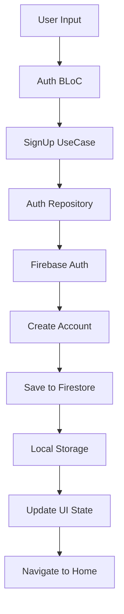
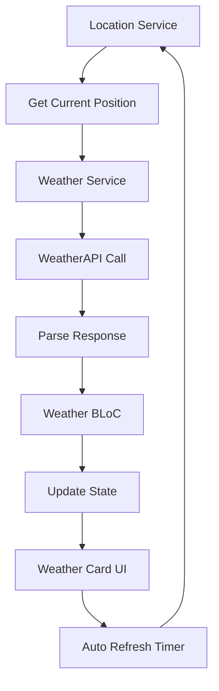
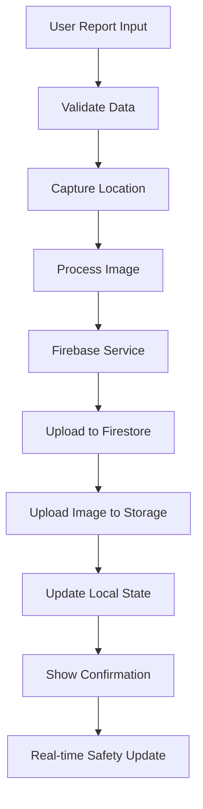
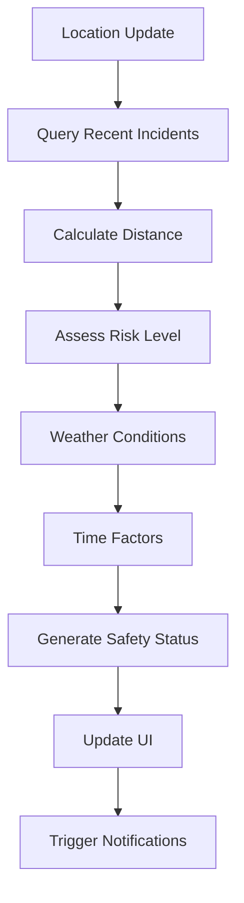
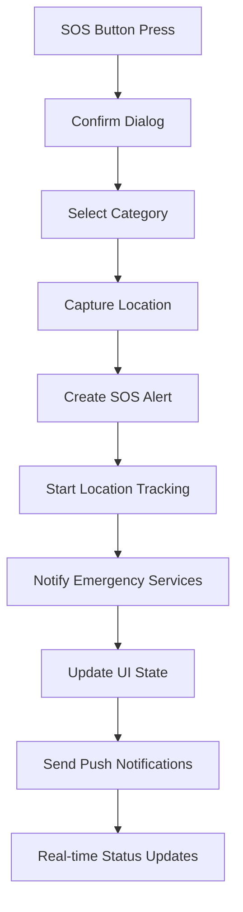
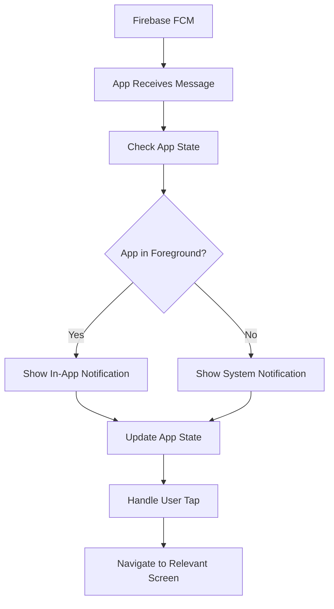

# 5. Data Flow Documentation

## 🔄 Application Data Flow Architecture

Understanding how data flows through SafeCom is crucial for debugging, maintenance, and feature development. This document outlines all major data flows in the application.

## 🎯 Core Data Flow Patterns

### 1. Clean Architecture Data Flow
```
UI Layer → BLoC → Use Case → Repository → Data Source → External Service
                    ↓
UI Layer ← BLoC ← Use Case ← Repository ← Data Source ← External Service
```

### 2. Real-time Data Flow
```
Firebase Streams → Service Layer → BLoC State → UI Auto-update
```

### 3. Local Storage Flow
```
User Action → Service → SharedPreferences/Memory → State Update → UI
```

## 🔐 Authentication Data Flows

### User Registration Flow


**Detailed Steps**:
1. **User Input**: Email, password, name, phone
2. **Validation**: Client-side input validation
3. **Firebase Auth**: Create authentication account
4. **User Profile**: Save additional data to Firestore
5. **Local Storage**: Store login state and user data
6. **State Update**: Update BLoC state to authenticated
7. **Navigation**: Navigate to appropriate home screen

### User Sign-In Flow
```dart
// UI Event
BlocProvider.of<AuthBloc>(context).add(
  AuthSignInRequested(email: email, password: password)
);

// BLoC Processing
Future<void> _onSignInRequested(
  AuthSignInRequested event,
  Emitter<AuthState> emit,
) async {
  emit(AuthLoading());
  
  final result = await signInUseCase(
    email: event.email,
    password: event.password,
  );
  
  result.fold(
    (failure) => emit(AuthError(failure.message)),
    (user) => emit(AuthSuccess(user)),
  );
}

// Repository Implementation
@override
Future<Result<User>> signIn(String email, String password) async {
  try {
    // Firebase Authentication
    final userCredential = await firebaseAuth.signInWithEmailAndPassword(
      email: email,
      password: password,
    );
    
    // Local Storage
    await authLocalDataSource.saveUser(userCredential.user);
    
    return Success(User.fromFirebase(userCredential.user));
  } catch (e) {
    return Failure(AuthFailure(e.toString()));
  }
}
```

### Session Management Flow
```
App Launch → Check Local Storage → Validate Firebase Token → Update Auth State
```

## 🌤️ Weather Data Flow

### Real-time Weather Updates


**Implementation**:
```dart
// Weather BLoC Stream
Stream<WeatherState> _mapGetWeatherToState() async* {
  yield WeatherLoading();
  
  try {
    // Get current location
    final position = await locationService.getCurrentPosition();
    
    // Fetch weather data
    final weatherData = await weatherService.getCurrentWeather(
      latitude: position.latitude,
      longitude: position.longitude,
    );
    
    yield WeatherLoaded(Weather.fromMap(weatherData));
    
    // Set up periodic updates
    yield* _periodicWeatherUpdates(position);
  } catch (e) {
    yield WeatherError(e.toString());
  }
}

// Periodic Updates
Stream<WeatherState> _periodicWeatherUpdates(Position position) async* {
  await for (final _ in Stream.periodic(Duration(minutes: 15))) {
    try {
      final weatherData = await weatherService.getCurrentWeather(
        latitude: position.latitude,
        longitude: position.longitude,
      );
      yield WeatherLoaded(Weather.fromMap(weatherData));
    } catch (e) {
      // Continue with last known state on error
    }
  }
}
```

## 🚨 Emergency Reporting Data Flow

### Incident Report Submission


**Detailed Implementation**:
```dart
// Report Submission Flow
Future<Map<String, dynamic>> submitEmergencyReport({
  required String type,
  required String description,
  String? selectedOption,
  String? location,
  File? image,
}) async {
  try {
    // 1. Get current user
    User? user = _auth.currentUser;
    if (user == null) {
      return {'success': false, 'message': 'Please sign in to submit a report'};
    }

    // 2. Build report data
    Map<String, dynamic> reportData = {
      'type': type,
      'description': description,
      'userId': user.uid,
      'userEmail': user.email,
      'timestamp': FieldValue.serverTimestamp(),
      'status': 'active',
      'location': location,
    };

    // 3. Add type-specific data
    if (type == 'disaster') {
      reportData['disasterType'] = selectedOption;
    } else if (type == 'harassment') {
      reportData['gender'] = selectedOption;
    }

    // 4. Upload image if provided
    if (image != null) {
      String imageUrl = await _uploadReportImage(image, type);
      reportData['imageUrl'] = imageUrl;
    }

    // 5. Save to Firestore
    DocumentReference docRef = await _firestore
        .collection('emergency_reports')
        .add(reportData);

    // 6. Update real-time safety data
    await _updateSafetyIncidents(reportData);

    return {
      'success': true,
      'message': 'Report submitted successfully',
      'reportId': docRef.id,
    };
  } catch (e) {
    return {
      'success': false,
      'message': 'Failed to submit report. Please try again.',
    };
  }
}
```

## 🛡️ Real-time Safety Status Flow

### Safety Status Calculation


**Stream Implementation**:
```dart
Stream<Map<String, dynamic>> getSafetyStatusStream({String? category}) async* {
  try {
    // Get current location
    Position? position = await _getCurrentLocation();
    
    if (position == null) {
      yield _getDefaultSafetyStatus();
      return;
    }

    // Build query for recent incidents
    Query query = _firestore
        .collection('safety_incidents')
        .where(
          'timestamp',
          isGreaterThan: DateTime.now().subtract(Duration(hours: 24)),
        );

    // Add category filter if specified
    if (category != null) {
      query = query.where('category', isEqualTo: category);
    }

    // Stream real-time incident data
    await for (QuerySnapshot snapshot in query.snapshots()) {
      List<Map<String, dynamic>> nearbyIncidents = [];

      // Filter incidents by distance
      for (var doc in snapshot.docs) {
        final data = doc.data() as Map<String, dynamic>;
        if (data['latitude'] != null && data['longitude'] != null) {
          double distance = Geolocator.distanceBetween(
            position.latitude,
            position.longitude,
            data['latitude'],
            data['longitude'],
          );

          // Include incidents within 5km
          if (distance <= 5000) {
            nearbyIncidents.add({...data, 'distance': distance});
          }
        }
      }

      // Calculate and yield safety status
      yield _calculateSafetyStatus(nearbyIncidents, position, category);
    }
  } catch (e) {
    yield _getErrorSafetyStatus();
  }
}
```

## 📱 SOS Alert Data Flow

### SOS Activation Flow


**SOS Implementation**:
```dart
Future<Map<String, dynamic>> triggerSOS({String category = 'general'}) async {
  try {
    User? user = _auth.currentUser;
    if (user == null) {
      return {'success': false, 'message': 'Please sign in to use SOS'};
    }

    // Get current location
    Position? position = await _getCurrentLocation();

    // Create SOS data
    Map<String, dynamic> sosData = {
      'userId': user.uid,
      'userEmail': user.email,
      'timestamp': FieldValue.serverTimestamp(),
      'type': 'sos',
      'category': category,
      'status': 'active',
      'urgency': 'critical',
      'latitude': position?.latitude,
      'longitude': position?.longitude,
      'accuracy': position?.accuracy,
      'responseRequested': true,
    };

    // Save to SOS alerts collection
    DocumentReference sosRef = await _firestore
        .collection('sos_alerts')
        .add(sosData);

    // Also add to safety incidents for area monitoring
    await _firestore.collection('safety_incidents').add({
      ...sosData,
      'description': 'SOS Alert Triggered - ${category.toUpperCase()}',
      'type': 'emergency',
    });

    // Start real-time location tracking
    _startLocationTracking(sosRef.id);

    return {
      'success': true,
      'message': 'SOS Alert sent! Help is on the way.',
      'sosId': sosRef.id,
    };
  } catch (e) {
    return {'success': false, 'message': 'Failed to send SOS alert'};
  }
}
```

## 🔄 State Management Data Flow

### BLoC State Updates
```dart
// Event Dispatch
context.read<SafetyBloc>().add(LoadSafetyStatus(category: 'disaster'));

// State Emission
class SafetyBloc extends Bloc<SafetyEvent, SafetyState> {
  final SafetyDataService safetyService;

  SafetyBloc({required this.safetyService}) : super(SafetyInitial()) {
    on<LoadSafetyStatus>(_onLoadSafetyStatus);
  }

  Future<void> _onLoadSafetyStatus(
    LoadSafetyStatus event,
    Emitter<SafetyState> emit,
  ) async {
    emit(SafetyLoading());

    await emit.forEach<Map<String, dynamic>>(
      safetyService.getSafetyStatusStream(category: event.category),
      onData: (safetyData) => SafetyLoaded(
        status: safetyData['status'],
        riskLevel: safetyData['riskLevel'],
        lastUpdated: safetyData['lastUpdated'],
      ),
      onError: (error, stackTrace) => SafetyError(error.toString()),
    );
  }
}

// UI State Listening
BlocBuilder<SafetyBloc, SafetyState>(
  builder: (context, state) {
    if (state is SafetyLoading) {
      return CircularProgressIndicator();
    } else if (state is SafetyLoaded) {
      return SafetyStatusCard(
        status: state.status,
        riskLevel: state.riskLevel,
        lastUpdated: state.lastUpdated,
      );
    } else if (state is SafetyError) {
      return ErrorWidget(state.message);
    }
    return Container();
  },
)
```

## 💾 Local Data Persistence Flow

### SharedPreferences Flow
```dart
// Data Storage
Future<bool> saveUserData(String name, String email, String phone) async {
  try {
    final prefs = await SharedPreferences.getInstance();
    
    final results = await Future.wait([
      prefs.setString('user_name', name),
      prefs.setString('user_email', email),
      prefs.setString('user_phone', phone),
      prefs.setBool('is_logged_in', true),
    ]);
    
    return results.every((result) => result);
  } catch (e) {
    return false;
  }
}

// Data Retrieval
Future<Map<String, String?>> getUserData() async {
  try {
    final prefs = await SharedPreferences.getInstance();
    
    return {
      'name': prefs.getString('user_name'),
      'email': prefs.getString('user_email'),
      'phone': prefs.getString('user_phone'),
    };
  } catch (e) {
    return {'name': null, 'email': null, 'phone': null};
  }
}
```

## 🔔 Push Notification Data Flow

### Notification Processing


## 📊 Error Handling Data Flow

### Error Propagation
```dart
// Service Level Error
try {
  final result = await weatherApi.getCurrentWeather(lat, lon);
  return Success(result);
} catch (e) {
  return Failure(WeatherFailure('Failed to fetch weather: ${e.toString()}'));
}

// Repository Level Error Handling
@override
Future<Result<Weather>> getCurrentWeather(double lat, double lon) async {
  try {
    final result = await weatherDataSource.getCurrentWeather(lat, lon);
    return result.fold(
      (failure) => Failure(failure),
      (weather) => Success(Weather.fromDataSource(weather)),
    );
  } catch (e) {
    return Failure(WeatherFailure('Repository error: ${e.toString()}'));
  }
}

// BLoC Level Error Handling
Future<void> _onGetWeather(GetWeather event, Emitter<WeatherState> emit) async {
  emit(WeatherLoading());
  
  final result = await weatherRepository.getCurrentWeather(
    event.latitude,
    event.longitude,
  );
  
  result.fold(
    (failure) => emit(WeatherError(failure.message)),
    (weather) => emit(WeatherLoaded(weather)),
  );
}

// UI Level Error Handling
BlocListener<WeatherBloc, WeatherState>(
  listener: (context, state) {
    if (state is WeatherError) {
      ScaffoldMessenger.of(context).showSnackBar(
        SnackBar(content: Text(state.message)),
      );
    }
  },
  child: WeatherWidget(),
)
```

## 🔄 Data Synchronization Patterns

### Offline-Online Sync (Future Enhancement)
```dart
class DataSyncService {
  // Queue offline actions
  static Future<void> queueOfflineAction(Map<String, dynamic> action) async {
    final prefs = await SharedPreferences.getInstance();
    final queue = prefs.getStringList('offline_queue') ?? [];
    queue.add(jsonEncode(action));
    await prefs.setStringList('offline_queue', queue);
  }
  
  // Sync when online
  static Future<void> syncOfflineQueue() async {
    final prefs = await SharedPreferences.getInstance();
    final queue = prefs.getStringList('offline_queue') ?? [];
    
    for (final actionJson in queue) {
      try {
        final action = jsonDecode(actionJson);
        await _processOfflineAction(action);
      } catch (e) {
        // Log error but continue with other actions
      }
    }
    
    await prefs.remove('offline_queue');
  }
}
```

---

Next: [Security & Privacy Documentation](./06-security-privacy.md)
